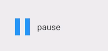
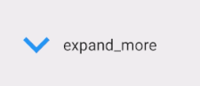
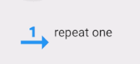

# Animated Icons
Animated icons implemented using [AnimatedVectorDrawable][1].

## Demo

| Name | Demo |
|------|------|
|[`PlayPauseButton.java`][2]||
|[`ExpandMoreLessButton.java`][3]||
|[`RepeatButton.java`][4]||

## Usage
See http://importre.github.io/anim-icons

Please open in Chrome (recommended)

[1]: https://developer.android.com/reference/android/graphics/drawable/AnimatedVectorDrawable.html
[2]: https://github.com/importre/anim-icons/blob/master/sample/app/src/main/java/io/github/importre/animatedicons/PlayPauseButton.java
[3]: https://github.com/importre/anim-icons/blob/master/sample/app/src/main/java/io/github/importre/animatedicons/ExpandMoreLessButton.java
[4]: https://github.com/importre/anim-icons/blob/master/sample/app/src/main/java/io/github/importre/animatedicons/RepeatButton.java
